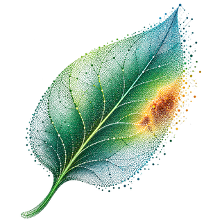
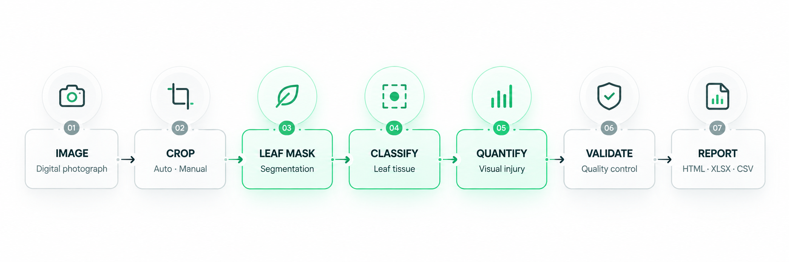
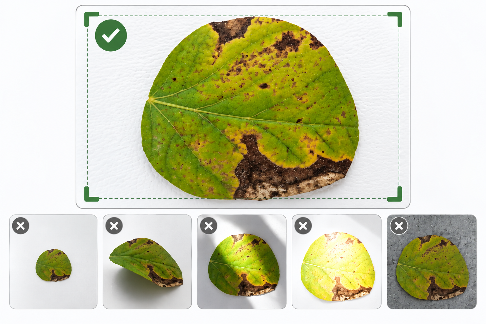
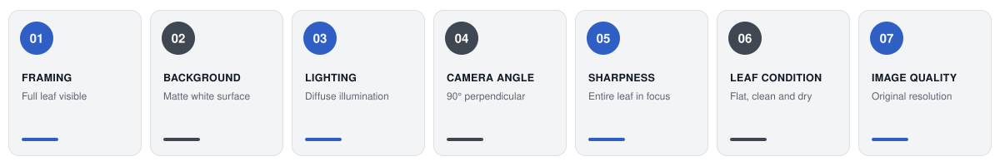
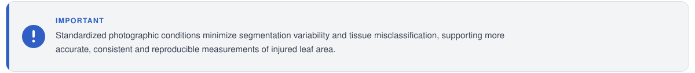
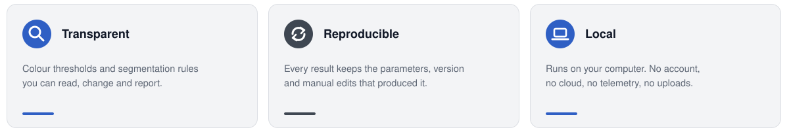
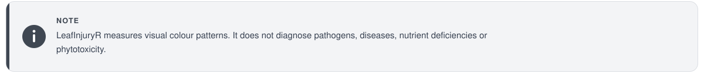
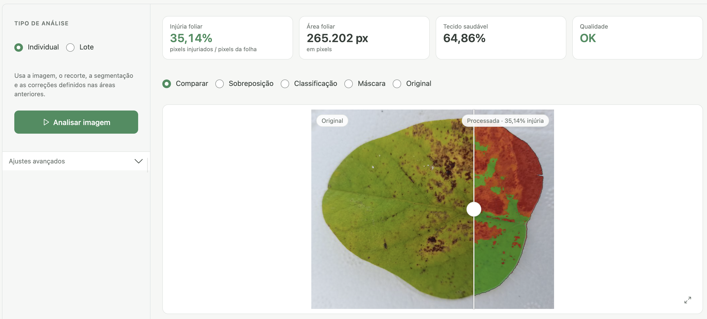
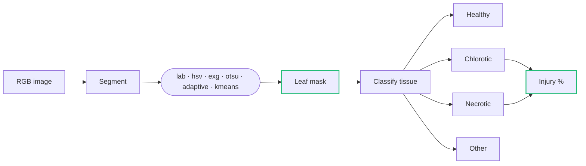
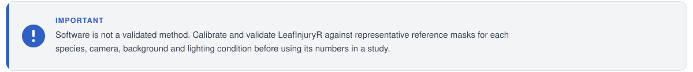

<p align="center">
  
</p>

<h1 align="center">LeafInjuryR</h1>

<p align="center">
  Measure visual leaf injury from photographs,<br>
  with every pixel decision open to inspection.
</p>

<p align="center">
  <a href="https://www.r-project.org/">= 4.2"></a>
  <a href="https://bioconductor.org/packages/EBImage/"></a>
  <a href="https://shiny.posit.co/"></a>
  
  
</p>

<p align="center">
  <a href="#image-acquisition-guidelines">Image guidelines</a> &nbsp;&nbsp;
  <a href="#installation">Install</a> &nbsp;&nbsp;
  <a href="#quick-start">Quick start</a> &nbsp;&nbsp;
  <a href="#the-app">The app</a> &nbsp;&nbsp;
  <a href="#how-it-works">How it works</a> &nbsp;&nbsp;
  <a href="#validation">Validation</a> &nbsp;&nbsp;
  <a href="#citation">Citation</a> &nbsp;&nbsp;
  <a href="#author">Author</a>
</p>

<br>

<p align="center">
  
</p>

<br>

## Image acquisition guidelines

Standardized image acquisition is essential for accurate leaf segmentation and reliable quantification of visual injury. Consistent photographic conditions reduce background interference, illumination artifacts and classification errors, improving reproducibility across samples.

<p align="center">
  
</p>

<p align="center">
  <sub>Recommended photographic conditions for consistent and reproducible leaf injury assessment.</sub>
</p>

<p align="center">
  
</p>

<p align="center">
  
</p>

<br>

<p align="center">
  
</p>

<br>

<p align="center">
  
</p>

<p align="center"><sub>Background pixels never enter the calculation.</sub></p>

<p align="center">
  
</p>

<br>

## Installation

LeafInjuryR depends on [EBImage](https://bioconductor.org/packages/EBImage/),
distributed through Bioconductor. Install it first, then the package from GitHub.

```r
install.packages(c("BiocManager", "remotes"))

BiocManager::install("EBImage")
remotes::install_github("wilhanvalasco/LeafInjuryR")

# Optional: packages used by the Shiny app
install.packages(c("shiny", "bslib", "DT"))
```

<br>

## Quick start

```r
library(LeafInjuryR)

file <- system.file("extdata", "leaf_example_02.jpg", package = "LeafInjuryR")

result <- analyze_leaf(file, crop = "auto", multiclass = TRUE)

result$metrics
plot(result)
```

```text
 leaf_pixels  injured_percent  chlorotic_percent  necrotic_percent
      428731            18.42              11.73              6.69
```

<sub>Illustrative output. Injured = chlorotic + necrotic.</sub>

### Six functions

| Function | What it does |
|:---|:---|
| `analyze_leaf()` | Analyse one image |
| `analyze_leaf_batch()` | Analyse a folder of images and write reports |
| `crop_leaf()` | Crop automatically or by hand |
| `segment_leaf()` | Build the leaf mask and classify tissue |
| `validate_leaf()` | Compare results with reference masks |
| `run_leafinjury_app()` | Open the local Shiny app |

<br>

## The app

The full workflow, without writing R code.

```r
run_leafinjury_app()
```

<p align="center">
  
</p>

<p align="center"><sub>Analysis tab: original photograph on the left, classified tissue on the right.</sub></p>

| Image | Segmentation | Analysis | Results |
|:---|:---|:---|:---|
| Import, crop, zoom, reset | Leaf mask, classification, manual correction, overlay | Single or batch, compare, progress | Table, validation, reports, export |

<br>

## How it works



Segmentation separates leaf from background; classification then runs
**only inside the leaf mask**.

```r
seg <- segment_leaf(image, method = "auto")
```

| Step | Methods |
|:---|:---|
| Segmentation | `auto`, `lab`, `hsv`, `exg`, `otsu`, `adaptive`, `kmeans` |
| Tissue classification | `auto`, `lab`, `relative`, `hsv`, `exgr`, `vote` |

### Manual correction

When the automatic mask is wrong, correct a region and recompute.
Corrections are stored with the analysis.

```r
img <- crop_leaf(file)
seg <- segment_leaf(img)

fix <- data.frame(
  action = "healthy",
  shape  = "rect",
  xmin = 40,  xmax = 140,
  ymin = 220, ymax = 300
)

seg_corrected <- segment_leaf(
  img,
  mode         = "manual",
  corrections  = fix,
  segmentation = seg
)

result <- analyze_leaf(img, segmentation = seg_corrected)
result$metrics
```

### Batch analysis

```r
batch <- analyze_leaf_batch(
  "folder_with_photos/",
  output_dir = "results/",
  crop       = "auto"
)
```

```text
results/
├── report.html     statistics, charts, image gallery, parameters
├── results.xlsx    results, summary, parameters
├── results.csv     analysis-ready table
├── masks/          segmentation masks
└── overlays/       processed overlays
```

### Scale calibration

Physical area is reported only when a valid scale is supplied.

```r
result <- analyze_leaf(file, pixels_per_cm = 118.4)
```

<p align="center">
  
</p>

<br>

## Validation

Compare the automated masks with manually drawn reference masks.

```r
validation <- validate_leaf(
  result,
  reference_leaf_mask   = "leaf_mask.png",
  reference_injury_mask = "injury_mask.png"
)

validation
```

Reported metrics: IoU, Dice, sensitivity, specificity, precision and F1.

<p align="center">
  
</p>

A suggested order for a study: acquire images, draw reference masks,
calibrate thresholds, validate, then analyse the full set.

<br>

## Reproducibility

```r
result$parameters
```

Each analysis records the package version, date, segmentation and
classification methods, thresholds, crop, scale and any manual corrections.

<br>

## Roadmap

| Version | Scope | Status |
|:---|:---|:---|
| 0.1 | Core analysis | Released |
| **0.2** | **Shiny app and reports** | **Current** |
| 0.3 | Extended validation | Planned |
| 1.0 | Stable API | Planned |
| Later | Machine learning, mobile | Exploring |

<br>

## Citation

```r
citation("LeafInjuryR")
```

## License

GPL (>= 3)

<br>

## Author

<br>

<div align="center">
  
  <p><sub><b>D E V E L O P E R &nbsp;&nbsp;·&nbsp;&nbsp; M A I N T A I N E R</b></sub></p>
  <h1>WILHAN VALASCO DOS SANTOS</h1>
  <p><i>Agronomist and data scientist building open tools for plant science.</i></p>
  <p><sub><b>A C A D E M I C &nbsp;&nbsp; P R O F I L E</b></sub></p>
  <p>
    
  </p>
  <p>
    <a href="mailto:wilhan.santos@hotmail.com"></a>
    &nbsp;
    <a href="https://wa.me/5564992862039"></a>
    &nbsp;
    <a href="https://github.com/wilhanvalasco"></a>
  </p>
</div>

<br>

---

<p align="center">
  <br>
  <sub>LeafInjuryR. Built with R, EBImage and Shiny.<br>
  Your images stay on your computer.</sub>
</p>
