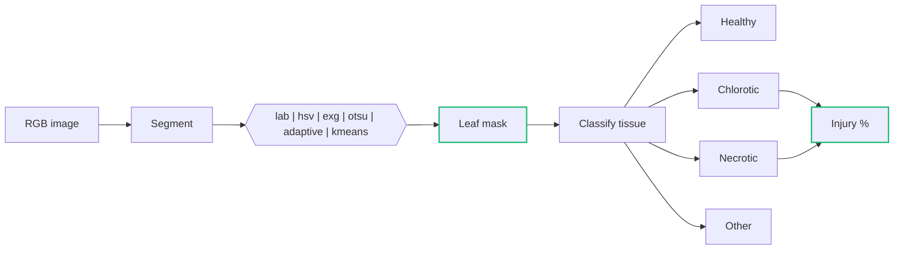

<p align="center">
  
</p>

<h1 align="center">LeafInjuryR</h1>

<p align="center">
  Measure visual leaf injury from photographs,<br>
  with every pixel decision open to inspection.
</p>

<p align="center">
  <a href="https://www.r-project.org/">= 4.2"></a>
  <a href="https://bioconductor.org/packages/EBImage/"></a>
  <a href="https://shiny.posit.co/"></a>
  
  
</p>

<p align="center">
  <a href="#installation">Install</a> &nbsp;&nbsp;&nbsp;
  <a href="#quick-start">Quick start</a> &nbsp;&nbsp;&nbsp;
  <a href="#the-app">The app</a> &nbsp;&nbsp;&nbsp;
  <a href="#how-it-works">How it works</a> &nbsp;&nbsp;&nbsp;
  <a href="#validation">Validation</a> &nbsp;&nbsp;&nbsp;
  <a href="#citation">Citation</a> &nbsp;&nbsp;&nbsp;
  <a href="#author">Author</a>
</p>

<br>

<p align="center">
  
</p>

<br>

<table>
  <tr>
    <td width="33%" valign="top">
      <b>Transparent</b><br>
      Colour thresholds and segmentation rules you can read, change and report.
    </td>
    <td width="33%" valign="top">
      <b>Reproducible</b><br>
      Every result keeps the parameters, version and manual edits that produced it.
    </td>
    <td width="33%" valign="top">
      <b>Local</b><br>
      Runs on your computer. No account, no cloud, no telemetry, no uploads.
    </td>
  </tr>
</table>

<br>

<p align="center">
  
</p>

<p align="center"><sub>Background pixels never enter the calculation.</sub></p>

> [!NOTE]
> LeafInjuryR measures visual colour patterns. It does not diagnose pathogens,
> diseases, nutrient deficiencies or phytotoxicity.

<br>

## Installation

LeafInjuryR depends on [EBImage](https://bioconductor.org/packages/EBImage/),
distributed through Bioconductor. Install it first, then the package from GitHub.

```r
install.packages(c("BiocManager", "remotes"))

BiocManager::install("EBImage")
remotes::install_github("wilhanvalasco/LeafInjuryR")

# Optional: packages used by the Shiny app
install.packages(c("shiny", "bslib", "DT"))
```

<br>

## Quick start

```r
library(LeafInjuryR)

file <- system.file("extdata", "leaf_example_02.jpg", package = "LeafInjuryR")

result <- analyze_leaf(file, crop = "auto", multiclass = TRUE)

result$metrics
plot(result)
```

```text
 leaf_pixels  injured_percent  chlorotic_percent  necrotic_percent
      428731            18.42              11.73              6.69
```

<sub>Illustrative output. Injured = chlorotic + necrotic.</sub>

### Six functions

| Function | What it does |
|:---|:---|
| `analyze_leaf()` | Analyse one image |
| `analyze_leaf_batch()` | Analyse a folder of images and write reports |
| `crop_leaf()` | Crop automatically or by hand |
| `segment_leaf()` | Build the leaf mask and classify tissue |
| `validate_leaf()` | Compare results with reference masks |
| `run_leafinjury_app()` | Open the local Shiny app |

<br>

## The app

The full workflow, without writing R code.

```r
run_leafinjury_app()
```

<p align="center">
  
</p>

<p align="center"><sub>Analysis tab: original photograph on the left, classified tissue on the right.</sub></p>

| Image | Segmentation | Analysis | Results |
|:---|:---|:---|:---|
| Import, crop, zoom, reset | Leaf mask, classification, manual correction, overlay | Single or batch, compare, progress | Table, validation, reports, export |

<br>

## How it works



Segmentation separates leaf from background; classification then runs
**only inside the leaf mask**.

```r
seg <- segment_leaf(image, method = "auto")
```

| Step | Methods |
|:---|:---|
| Segmentation | `auto`, `lab`, `hsv`, `exg`, `otsu`, `adaptive`, `kmeans` |
| Tissue classification | `auto`, `lab`, `relative`, `hsv`, `exgr`, `vote` |

### Manual correction

When the automatic mask is wrong, correct a region and recompute.
Corrections are stored with the analysis.

```r
img <- crop_leaf(file)
seg <- segment_leaf(img)

fix <- data.frame(
  action = "healthy",
  shape  = "rect",
  xmin = 40,  xmax = 140,
  ymin = 220, ymax = 300
)

seg_corrected <- segment_leaf(
  img,
  mode         = "manual",
  corrections  = fix,
  segmentation = seg
)

result <- analyze_leaf(img, segmentation = seg_corrected)
result$metrics
```

### Batch analysis

```r
batch <- analyze_leaf_batch(
  "folder_with_photos/",
  output_dir = "results/",
  crop       = "auto"
)
```

```text
results/
├── report.html     statistics, charts, image gallery, parameters
├── results.xlsx    results, summary, parameters
├── results.csv     analysis-ready table
├── masks/          segmentation masks
└── overlays/       processed overlays
```

### Scale calibration

Physical area is reported only when a valid scale is supplied.

```r
result <- analyze_leaf(file, pixels_per_cm = 118.4)
```

<p align="center">
  
</p>

<br>

## Validation

Compare the automated masks with manually drawn reference masks.

```r
validation <- validate_leaf(
  result,
  reference_leaf_mask   = "leaf_mask.png",
  reference_injury_mask = "injury_mask.png"
)

validation
```

Reported metrics: IoU, Dice, sensitivity, specificity, precision and F1.

> [!IMPORTANT]
> Software is not a validated method. Calibrate and validate LeafInjuryR
> against representative reference masks for each species, camera, background
> and lighting condition before using its numbers in a study.

A suggested order for a study: acquire images, draw reference masks,
calibrate thresholds, validate, then analyse the full set.

<br>

## Reproducibility

```r
result$parameters
```

Each analysis records the package version, date, segmentation and
classification methods, thresholds, crop, scale and any manual corrections.

<br>

## Roadmap

| Version | Scope | Status |
|:---|:---|:---|
| 0.1 | Core analysis | Released |
| **0.2** | **Shiny app and reports** | **Current** |
| 0.3 | Extended validation | Planned |
| 1.0 | Stable API | Planned |
| Later | Machine learning, mobile | Exploring |

<br>

## Citation

```r
citation("LeafInjuryR")
```

## License

GPL (>= 3)

<br>

## Author

<table class="author-card" width="100%">
  <tr>
    <td class="author-photo" width="38%" align="center" valign="bottom">
      <div class="author-frame">
        
      </div>
    </td>
    <td class="author-info" valign="middle">
      <p class="author-eyebrow"><sub>DEVELOPER AND MAINTAINER</sub></p>
      <h3 class="author-name">Wilhan Valasco dos Santos</h3>
      <p class="author-role">Agronomist and data scientist building open tools for plant science.</p>
      <ul class="author-cv">
        <li><b>Agronomist</b><br><span>IF Goiano</span></li>
        <li><b>MSc in Plant Protection</b><br><span>IF Goiano</span></li>
        <li><b>PhD candidate in Biotechnology and Biodiversity</b><br><span>IF Goiano</span></li>
        <li><b>Specialist in Data Science</b><br><span>FMSP</span></li>
        <li><b>MBA in Business Management</b><br><span>IF Goiano</span></li>
      </ul>
      <p class="author-contact">
        <a class="author-btn author-btn-primary" href="mailto:wilhan.santos@hotmail.com">wilhan.santos@hotmail.com</a>
        &nbsp;
        <a class="author-btn" href="https://wa.me/5564992862039">+55 (64) 99286-2039</a>
      </p>
    </td>
  </tr>
</table>

<br>

---

<p align="center">
  <br>
  <sub>LeafInjuryR. Built with R, EBImage and Shiny.<br>
  Your images stay on your computer.</sub>
</p>
